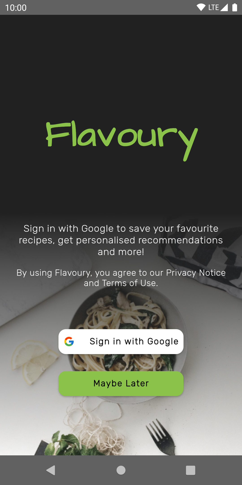
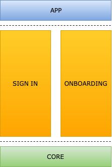

# Flavoury
Flavoury is an Android application that will allow users to search and discover cooking recipes, while offering a personalized experience, based on dietary preferences and food intolerances. It offers the option to sign in using a Google account, in order to enable remote user data persistence.

  

## Features
#### Completed
* Sign In
* Onboarding

#### Roadmap
* Recipe Search and Discovery
* Recipe Bookmarking
* App Settings

## Set Up
This project is dependent on Firebase and Google Sign In. For obvious reasons, the Firebase configuration file (`google-services.json`) was not checked in.

In order to get things working, you will need to:
1. [Create a Firebase project and associate the app with it](https://firebase.google.com/docs/android/setup);
2. [Configure a Google API Console project](https://developers.google.com/identity/sign-in/android/start-integrating#configure_a_project);
3. Add your Google Web application type client ID to `{user}/.gradle/gradle.properties` with the key `GOOGLE_OAUTH_2_WEB_CLIENT_ID`.

## Project Structure
Flavoury is written entirely in Kotlin and uses the Gradle build system. The app is currently made up of four modules, each belonging to one of three levels:
1. App module (`app`): links all features together, while orchestrating the navigation between them;
2. Feature modules (`sign_in`, `onboarding`): correspond with full-screen and coherent user facing functionality ("vertical slice");
3. Library modules (`core`): code shared across some or all features ("horizontal slice"); do not depend on any feature or app modules.

  

## Architecture
// TODO

## Work Management and Issue Tracking
A Kanban-style [Trello board](https://trello.com/b/PTm6Xphe/flavoury-app) was used for organizing all project work.

## UI/UX
Sketch, together with the [Material Theme Editor Plugin](https://material.io/resources/theme-editor/), were used for creating the UX flow and UI design for the app. All related work can be found in [the following repo](https://github.com/mirceabucerzan/flavoury-design).

## Contributing
Currently not open for contributions; this might change in the future, after the app is feature complete.

## License
[GNU AGPLv3](LICENSE.txt).
